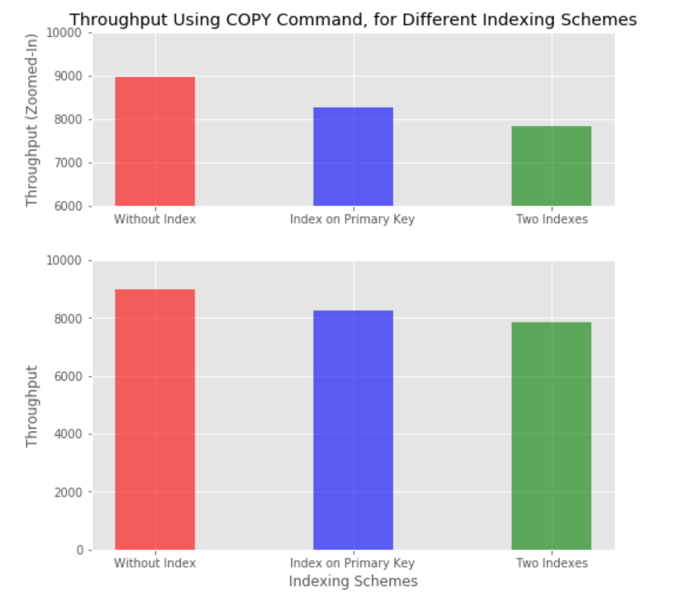
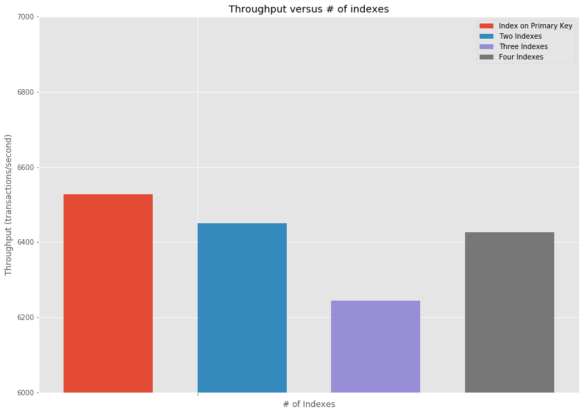
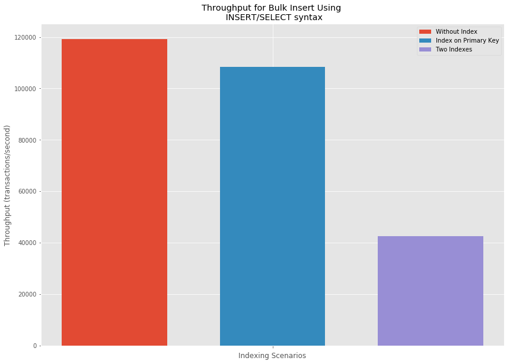

# Performance Experiment: Bulk Ingest

## Abstract

This experiment compares the performance of different methods of bulk insert against the "Digital Music Store" PostgreSQL database under various indexing strategies. First, we analyze the performance of Sequential Inserts. Second, we perform batch inserts and analyze the performance of the batch inserts with respect to number of indexes (primary, secondary, clustered), use of "Insert Into ... Select From" and few other scenarios. We got the best performance for batch-inserts with INSERT/SELECT and COPY commands.
We find that Batch Insert using INSERT/SELECT syntax with no indexes offers 2.8 times the throughput over inserting records with Two indexes on the table. A similar observation is recorded when using the COPY command during bulk-loading where inserts with no indexes offer 1.15 times the throughput as compared to 2 indexes.

## Hypothesis

#### Description of the conceptual experiment  

The experiment aims to analyze the performance for Bulk Insert on PostgreSQL by using different insertion/indexing mechanisms. There are two key points of comparison, based on which different conditions listed in the next section are designed:  

* Comparing Sequential Inserts with Batch Inserts*  
* Comparing Bulk Insert Performance in the Presence/Absence of Indexes*  

#### Conditions being tested  

Database: Digital Music Store  
Target Table: Track (song details)  
Number of records: 10,000  
Primary Key: TrackId  
Secondary Index Attribute: Name (song name)  

The following conditions were tested and compared as part of the analysis:   
* Inserting records sequentially without the use of any batch insert capabilities.  
* Using standard SQL batch insert statements, and varying batch sizes as: 1, 5, 10, 20, 50, 100, 1000, 2500  
* Creating an index on the primary key and then inserting records with different batch sizes.  
* Creating an additional secondary (non-clustered index) on another attribute of the table, and varying batch sizes for inserts.  
* Using bulk load features of the DBMS ('COPY FROM' command in case of PostgreSQL).  
* Incrementally adding more secondary indexes and performing inserts.  
* Performing bulk inserts by reading from another table, i.e. using the 'INSERT INTO....SELECT FROM' syntax.  

#### Expectations    

* It was expected that inserting records sequentially would result in the lowest throughput among all other scenarios.  
* When using standard SQL batch inserts, we hoped to see a steady increase in throughput with the increase in batch size. However, beyond a certain batch size, we hypothesized that the increase in throughput would stabilize.  
* Although PostgreSQL does not support clustered indexes and requires an explicit 'cluster' action to be performed, we hoped that even creating a non-clustered index on the primary key would bring down the insert performance, and that the effect would be more pronounced for smaller batch sizes.  
* With the addition of a second non-clustered index, it was anticipated that inserts would slow down even further, and keep deteriorating with the addition of more secondary indexes.  
* Use of PostgreSQL native bulk insert functionality using 'COPY FROM' was expected to yield better results than using standard SQL batch inserts.  
* Lastly, by using the 'INSERT INTO...SELECT FROM' syntax, we hoped to achieve the best results across conditions, assuming that it helped the database engine to cut down on the overhead related to parsing and executing insert queries, and simply copy the rows that exist in another table.

## Assumptions and Setup

In our experiment, we used synthetic data that we generated using the [Log-synth](https://github.com/tdunning/log-synth) (Dunning, 2017) tool based on the data-model of [Chinook](https://github.com/lerocha/chinook-database) database (Rocha, 2017). Log-synth is a utility that allows for random data generation based on a schema. There is support for the generation of addresses, dates, foreign key references, unique id numbers, random integers, realistic person names and street names. It is available as a standalone executable, which can be run from the command line.

Chinook data-model represents a digital media store, including tables for artists, albums, media tracks, invoices and customers. *Track* entity was selected for the experiments, which has nine columns – TrackId, Name, AlbumId, MediaTypeId, GenreId, Composer, Milliseconds, Bytes, and UnitPrice.

The database was configured and hosted on cloud as an Amazon RDS (PostgreSQL) instance with [db.t2.micro](https://docs.aws.amazon.com/AmazonRDS/latest/UserGuide/Concepts.DBInstanceClass.html) (1 virtual CPU, 1 GiB of RAM, not EBS-Optimized, and low network performance as compared to other DB instance classes) class (Amazon Web Services, Inc., 2018).

Assumptions:
-	Using Python to connect with the RDS (PostgreSQL) instance and to run the queries with the help of [Psycopg](http://initd.org/psycopg/) library (Varrazzo, 2018) doesn’t have any significant impact on the outlined experiments
-	Impact of network latency is negligible, and ignored

Timings were measured programmatically in Python using the [time](https://docs.python.org/3/library/time.html) module (Python Software Foundation, 2018). Time was recorded before and after the SQL query execution commands and subsequently, the difference was noted.

## Main Result

* 

## Additional Experiments

### a) Bulk-loading Using COPY Command
**Group Member:** Prateek Tripathi

* 

### b) Multiple secondary Indexes
**Group Member:** Aakash Agrawal

* Overall, the throughput decreases as the number of indexes increases. However, for 4 indexes the throughput has increased compared to 3 indexes

### c)

### d) Insert records using the INSERT / SELECT syntax  
**Group Member:** Harkar Talwar  

* The above results are in agreement with our hypothesis. 
* Overall, the throughput is the highest among all scenarios. 
* The throughput is however reduced by 9% in the presence of an index on the primary key.
* The presence of a secondary index results in a large 64% drop in throughput for the insert operation. 

## Conclusions and Discussion

## References

Amazon Web Services, Inc. (2018). *DB Instance Class*. Retrieved from https://docs.aws.amazon.com/AmazonRDS/latest/UserGuide/Concepts.DBInstanceClass.html

Dunning, T. (2017). *Log-synth*. Retrieved from https://github.com/tdunning/log-synth

Python Software Foundation. (2018). *time — Time access and conversions*. Retrieved from https://docs.python.org/3/library/time.html  

Rocha, L. (2017). *Chinook Database*. Retrieved from https://github.com/lerocha/chinook-database 

Varrazzo, D. (2018). *psycopg*. Retrieved from http://initd.org/psycopg/ 
